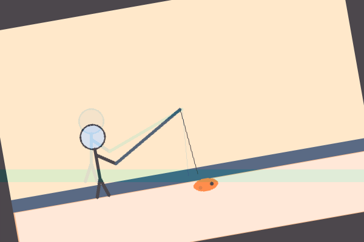

<h1 align="center">🧠 UTS Computer Vision</h1>

  <b>Proyek Tugas Tengah Semester - OpenCV (Python)</b> 
  <i>“Simulasi karakter pemancing seperti di game Roblox: Fish It 🎣”</i>

---

## 👤 Identitas Mahasiswa

| Nama | NIM |
|------|-----|
| Engga Saputra | 43050230029 |

---

## 🎨 Deskripsi Karakter

Karakter yang dibuat menggambarkan *seorang pemancing sederhana* yang sedang memancing di tepi air, seperti dalam game *Roblox: Fish It*.  
Objek dibuat manual menggunakan fungsi dasar OpenCV, tanpa gambar eksternal.

Elemen yang digambar:
- Kepala, badan, tangan, dan kaki (gaya stickman)
- Joran pancing dan tali pancing
- Permukaan air, tanah tepi sungai, dan ikan kecil di ujung tali

🖌 Fungsi yang digunakan:
python
cv2.circle(), cv2.line(), cv2.rectangle(), cv2.ellipse()

| Jenis Transformasi | Penjelasan                                                     |
| ------------------ | -------------------------------------------------------------- |
| **Translasi**      | Menggeser posisi karakter ke kanan dan sedikit ke atas         |
| **Rotasi**         | Memutar karakter sekitar 10° agar tampak dinamis               |
| **Resize**         | Mengubah ukuran gambar menjadi lebih kecil (300x200)           |
| **Crop**           | Memotong area karakter dan joran untuk fokus pada subjek utama |

| Jenis Operasi        | Fungsi                                  | Kegunaan                                                        |
| -------------------- | --------------------------------------- | --------------------------------------------------------------- |
| **Bitwise AND & OR** | `cv2.bitwise_and()`, `cv2.bitwise_or()` | Menggabungkan karakter dengan latar senja                       |
| **AddWeighted**      | `cv2.addWeighted()`                     | Menggabungkan hasil rotasi dan bitwise menjadi komposisi lembut |
UTS_ComputerVision/
│
├── karakter.py
├── img/
│   └── background.jpg  (opsional)
├── output/
│   ├── karakter.png
│   ├── translate.png
│   ├── rotate.png
│   ├── resize.png
│   ├── crop.png
│   ├── bitwise.png
│   └── final.png
└── README.md

✅ Kesimpulan

Program ini berhasil:

Membuat karakter buatan sendiri (pemancing sederhana)

Menerapkan 4 transformasi citra

Menggunakan 2 operasi bitwise

Menghasilkan komposisi visual akhir dengan teknik addWeighted

💻 Dibuat menggunakan Python, OpenCV, dan NumPy
📘 Sesuai panduan UTS Computer Vision - Universitas Teknologi Digital Indonesia

 🎣 <b>Selamat memancing pixel dan semoga dapat ikan besar di ujian akhir!</b> 🐟 
 
